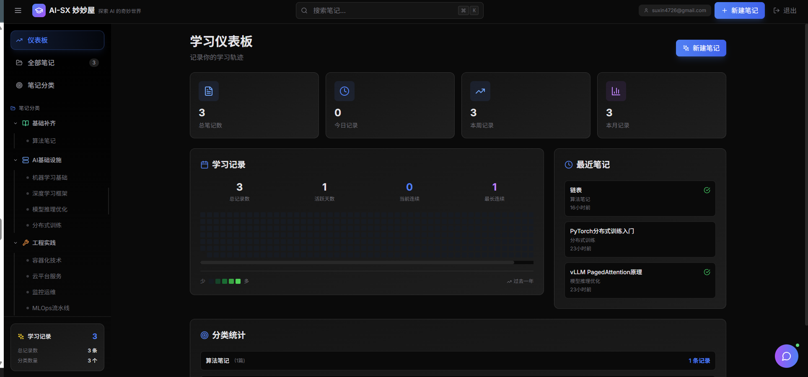

# 🎨 AI-SX 妙妙屋

<div align="center">


**一个功能强大的 AI 驱动笔记应用，支持 Markdown、数学公式、代码高亮，以及智能 AI 写作助手**

[🌐 在线演示](https://ai-notes-h2u49eu67-suxins-projects-d617dd70.vercel.app/) • [功能特性](#-功能特性) • [快速开始](#-快速开始) • [技术栈](#-技术栈) • [贡献](#-贡献)

[](https://star-history.com/#sxvvv/ai-notes&Date)

</div>

---

## ✨ 功能特性

### 📝 核心功能

- **🎨 优雅的 Markdown 编辑器** - 支持完整的 Markdown 语法，实时预览
- **🔢 数学公式支持** - LaTeX 公式支持（行内和块级），完美渲染
- **💻 代码高亮** - 支持 100+ 种编程语言的语法高亮
- **📊 GitHub 风格贡献图** - 可视化你的学习记录和每日贡献
- **📁 多级分类管理** - 支持无限层级的分类和子分类
- **🏷️ 标签系统** - 灵活的标签管理，快速分类和检索

### 🤖 AI 智能助手

- **💬 AI 聊天助手** - 随时与 AI 对话，获取帮助和建议

### 🔐 安全与权限

- **🔒 服务端权限验证** - 基于 Supabase Auth 的安全认证
- **👁️ 访客只读模式** - 访客可以查看，只有授权用户可以编辑
- **🔑 灵活的权限控制** - 支持单邮箱或多用户编辑权限

### 🎨 用户体验

- **📱 完全响应式** - 完美适配桌面、平板和移动设备
- **🌙 深色主题** - 护眼的深色主题设计
- **⌨️ 快捷键支持** - 丰富的键盘快捷键，提高效率
- **📊 数据可视化** - 学习记录统计和贡献图

## 🚀 快速开始

### 前置要求

- Node.js 18+ 
- npm 或 yarn
- Supabase 账号（用于数据库和认证）
- AI API（可选，用于 AI 功能）

### 安装步骤

1. **克隆仓库**

```bash
git clone https://github.com/sxvvv/ai-notes.git
cd ai-notes
```

2. **安装依赖**

```bash
npm install
```

3. **配置环境变量**

复制 `.env.example` 为 `.env` 并填写配置：

```bash
cp .env.example .env
```

编辑 `.env` 文件：

```env
VITE_SUPABASE_URL=your_supabase_url
VITE_SUPABASE_ANON_KEY=your_supabase_anon_key
VITE_AI_API_URL=https://api.zetatechs.com/v1/messages
VITE_AI_API_KEY=your_ai_api_key
VITE_ALLOWED_EDITOR_EMAIL=your_email@example.com
```

4. **设置 Supabase 数据库**

- 在 Supabase Dashboard 中创建项目
- 执行 `supabase/tables/*.sql` 创建表结构
- 执行 `supabase/migrations/enable_auth_rls.sql` 启用 RLS
- 执行 `supabase/migrations/restrict_to_single_email.sql` 限制编辑权限（可选）

5. **启动开发服务器**

```bash
npm run dev
```

访问 http://localhost:5173

## 🌐 在线演示

**立即体验**：[https://ai-notes-h2u49eu67-suxins-projects-d617dd70.vercel.app/](https://ai-notes-h2u49eu67-suxins-projects-d617dd70.vercel.app/)

> 💡 **提示**：访客可以查看所有笔记，编辑功能需要登录。按 `Ctrl+Shift+E` 打开登录对话框。

## 📸 功能演示



### 主要功能

- 📊 **仪表板** - 查看学习统计和贡献图
- 📝 **笔记列表** - 快速浏览和搜索笔记
- ✏️ **编辑器** - 强大的 Markdown 编辑器
- 🤖 **AI 写作** - 选中文字，一键优化、扩展、总结
- 🔢 **AI 公式** - 自然语言生成 LaTeX 公式
- 💬 **AI 聊天** - 随时与 AI 对话

## 🛠️ 技术栈

### 前端
- **React 18** - UI 框架
- **TypeScript** - 类型安全
- **Vite** - 快速构建工具
- **Tailwind CSS** - 实用优先的 CSS 框架
- **Lucide React** - 精美的图标库

### 后端
- **Supabase** - 后端即服务
  - PostgreSQL 数据库
  - 实时数据同步
  - 用户认证系统
  - Row Level Security (RLS)

### Markdown 渲染
- **react-markdown** - Markdown 渲染
- **remark-gfm** - GitHub Flavored Markdown
- **remark-math** - 数学公式支持
- **rehype-katex** - LaTeX 渲染
- **rehype-highlight** - 代码高亮

## ⌨️ 快捷键

| 快捷键 | 功能 |
|--------|------|
| `Ctrl+K` / `Cmd+K` | 聚焦搜索框 |
| `Ctrl+N` / `Cmd+N` | 新建笔记 |
| `Ctrl+S` / `Cmd+S` | 保存笔记 |
| `Ctrl+P` / `Cmd+P` | 切换预览模式 |
| `Ctrl+Shift+E` / `Cmd+Shift+E` | 打开登录对话框 |
| `Esc` | 关闭编辑器或返回 |

## 📚 文档

- [📖 部署指南](./DEPLOY.md) - Vercel、Netlify 等部署说明
- [🔐 权限配置](./AUTH_SETUP.md) - 服务端权限验证配置
- [🔒 权限限制](./RESTRICT_EMAIL.md) - 单邮箱权限配置

## 🌟 项目亮点

- ✨ **现代化技术栈** - 使用最新的 React 18 和 TypeScript
- 🚀 **快速开发** - Vite 构建工具，热更新速度快
- 🔒 **安全可靠** - 服务端权限验证，数据安全有保障
- 📱 **响应式设计** - 完美适配各种设备
- 🤖 **AI 集成** - 强大的 AI 助手，提升写作效率
- 🎨 **优雅 UI** - 精美的界面设计，优秀的用户体验

## 🤝 贡献

欢迎贡献！请遵循以下步骤：

1. Fork 本仓库
2. 创建特性分支 (`git checkout -b feature/AmazingFeature`)
3. 提交更改 (`git commit -m 'Add some AmazingFeature'`)
4. 推送到分支 (`git push origin feature/AmazingFeature`)
5. 开启 Pull Request

### 贡献指南

- 提交前请运行 `npm run build` 确保没有错误
- 遵循现有的代码风格
- 添加适当的注释和文档
- 确保所有功能正常工作

## 📄 许可证

本项目采用 MIT 许可证 - 查看 [LICENSE](LICENSE) 文件了解详情

## 🙏 致谢

- [Supabase](https://supabase.com/) - 强大的后端服务
- [Vercel](https://vercel.com/) - 优秀的部署平台
- [React](https://react.dev/) - 优秀的 UI 框架
- [Tailwind CSS](https://tailwindcss.com/) - 实用的 CSS 框架
- [Lucide](https://lucide.dev/) - 精美的图标库

## 📊 项目统计


## 🔗 相关链接

- [🌐 在线演示](https://ai-notes-h2u49eu67-suxins-projects-d617dd70.vercel.app/) - 立即体验完整功能
- [📝 问题反馈](https://github.com/sxvvv/ai-notes/issues) - 提交 Bug 或功能请求
- [💬 讨论区](https://github.com/sxvvv/ai-notes/discussions) - 参与讨论
- [📚 部署指南](./DEPLOY.md) - 部署到 Vercel、Netlify 等平台

---

<div align="center">

**如果这个项目对你有帮助，请给一个 ⭐ Star！**

Made with ❤️ by [sxvvv](https://github.com/sxvvv)

</div>
